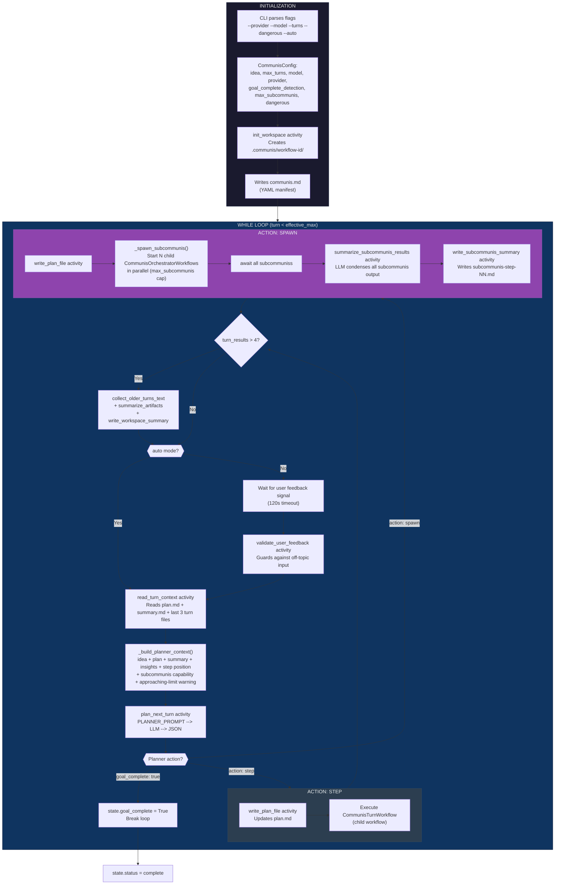
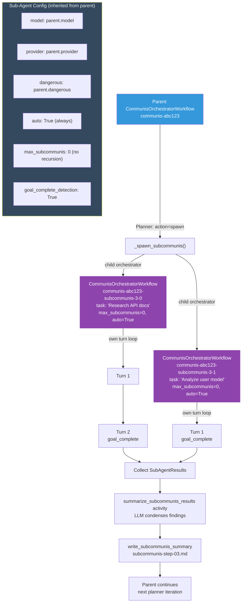
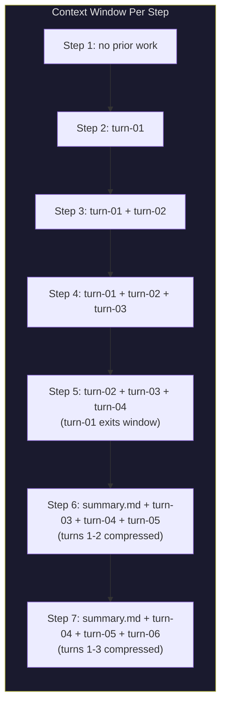
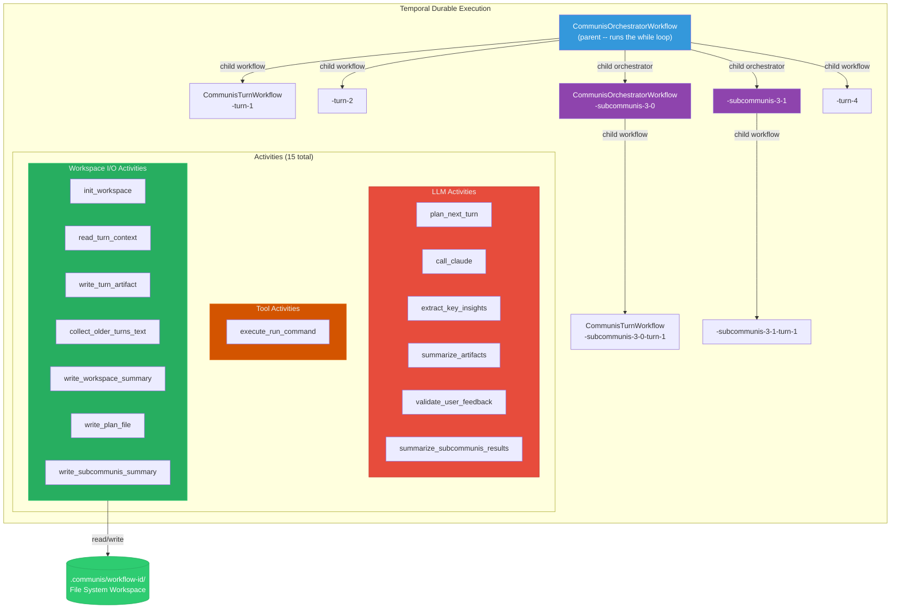

# communis Architecture Diagrams

**Goal-driven agent with durable execution, tool use, subcommunis spawning, and human-in-the-loop approval.**

---

## 1. Full Orchestration Flow

The orchestrator runs a `while` loop. Each iteration, the planner chooses one of three actions: execute a step, spawn parallel subcommuniss, or signal goal completion.



---

## 2. Child Turn Workflow — Agent Loop with Tool Use

Each step runs as a child `CommunisTurnWorkflow`. The agent calls the LLM, which can invoke the `run` tool to execute shell commands. The loop repeats until the LLM stops requesting tools (max 20 iterations).

```mermaid
flowchart TD
    subgraph TURN["CommunisTurnWorkflow"]
        direction TB
        RCTX["read_turn_context activity<br/>Reads summary.md + last 3 turn files (full content)"]
        BUM["_build_user_message()<br/>Goal + Position + Summary + Recent Work + Feedback"]
        SYS["TURN_AGENT_PROMPT_WITH_TOOLS<br/>System: 'You are: {role} ... You have a run tool ...'"]

        RCTX --> BUM --> SYS

        subgraph AGENT_LOOP["AGENT LOOP (max 20 iterations)"]
            direction TB
            LLM["call_claude activity<br/>messages + system_prompt + tools --> LLM"]
            CHECK{{"stop_reason?"}}
            LLM --> CHECK

            CHECK -->|"end_turn<br/>(no tool_use)"| DONE_LOOP["Break -- agent is done"]
            CHECK -->|"tool_use"| TOOL_PROCESS

            subgraph TOOL_PROCESS["TOOL EXECUTION"]
                direction TB
                APPROVAL{{"--dangerous?"}}
                APPROVAL -->|Yes| EXEC["execute_run_command activity<br/>subprocess with shell=True"]
                APPROVAL -->|No| WAIT_APPROVE["Set pending_tool query<br/>Wait for approve_tool signal"]
                WAIT_APPROVE -->|Approved| EXEC
                WAIT_APPROVE -->|Denied| DENIED["Return denial message"]

                subgraph PRESENTATION["Presentation Layer"]
                    BINARY["Binary guard<br/>(rejects non-text output)"]
                    OVERFLOW["Overflow truncation<br/>(200 lines / 50KB cap)"]
                    FOOTER["Metadata footer<br/>[exit:N | Xms]"]
                    STDERR["Stderr attachment"]
                    BINARY --> OVERFLOW --> FOOTER --> STDERR
                end

                EXEC --> PRESENTATION
            end

            TOOL_PROCESS -->|"tool_result<br/>appended to messages"| LLM
        end

        SYS --> AGENT_LOOP

        EKI["extract_key_insights activity<br/>LLM --> JSON array of 3-5 insights"]
        WTA["write_turn_artifact activity<br/>Writes turn-NN-role.md<br/>(YAML frontmatter + content)"]
        RESULT["Return TurnResult<br/>(metadata only -- content in workspace file)"]

        DONE_LOOP --> EKI --> WTA --> RESULT
    end

    style TURN fill:#533483,stroke:#16213e,color:#e2e2e2
    style AGENT_LOOP fill:#2c3e50,stroke:#34495e,color:#ecf0f1
    style TOOL_PROCESS fill:#c0392b,stroke:#e74c3c,color:#ecf0f1
    style PRESENTATION fill:#d35400,stroke:#e67e22,color:#ecf0f1
```

---

## 3. Sub-Agent Spawning

When the planner returns `action: "spawn"`, the orchestrator starts parallel child orchestrator workflows. Subcommuniss have `max_subcommunis=0` to prevent recursion.



---

## 4. Workspace File Structure

```
.communis/<workflow-id>/
  communis.md                       # Session manifest (YAML: idea, max_turns, model)
  plan.md                       # Rolling plan summary (updated each step by planner)
  turn-01-researcher.md         # Turn artifact (YAML frontmatter + full content)
  turn-02-implementer.md
  subcommunis-step-03.md          # LLM summary of subcommunis results from step 3
  subcommunis/                    # Subcommunis workspaces
    <id>-subcommunis-3-0/          # Each subcommunis gets its own full workspace
      communis.md
      plan.md
      turn-01-worker.md
    <id>-subcommunis-3-1/
      ...
  turn-04-synthesizer.md
  summary.md                    # Rolling summary (replaces old turns once > MAX_RECENT+1)
```

---

## 5. Sliding Context Window

What each step's LLM calls can see (MAX_RECENT_ARTIFACTS = 3):



The **planner** sees: idea + plan.md + summary + recent turn **insights** (metadata only).
The **turn agent** sees: idea + summary + recent turn **full content** + user feedback.

---

## 6. Prompt Anatomy — 7 LLM Prompts

```mermaid
flowchart TD
    subgraph PROMPTS["LLM PROMPTS"]
        direction TB

        subgraph P1["PLANNER_PROMPT (orchestrator, per-step)"]
            P1D["Input: goal + plan.md + summary + insights + step position + subcommunis budget<br/>Output: JSON with action (step / spawn / goal_complete)<br/>Decides WHAT to do next"]
        end

        subgraph P2["TURN_AGENT_PROMPT_WITH_TOOLS (child workflow, per-step)"]
            P2D["Input: goal + summary + recent turns full content + position<br/>Has run tool for shell commands<br/>Output: concrete work product (code, files, analysis)<br/>Does THE ACTUAL WORK"]
        end

        subgraph P3["EXTRACT_INSIGHTS_PROMPT (child workflow, post-step)"]
            P3D["Input: step's full output content<br/>Output: JSON array of 3-5 insight strings<br/>Creates METADATA for future planner decisions"]
        end

        subgraph P4["SUMMARIZE_ARTIFACTS_PROMPT (orchestrator, periodic)"]
            P4D["Input: full text of older turns being compressed<br/>Output: prose summary for summary.md<br/>COMPRESSES old turns to fit context window"]
        end

        subgraph P5["VALIDATE_FEEDBACK_PROMPT (orchestrator, on feedback)"]
            P5D["Input: goal + user feedback text<br/>Output: JSON {relevant, reason}<br/>Guards against off-topic human input"]
        end

        subgraph P6["SUMMARIZE_SUBAGENT_RESULTS_PROMPT (orchestrator, after spawn)"]
            P6D["Input: all subcommunis task/status/summary pairs<br/>Output: condensed summary for parent context<br/>Bridges subcommunis work back to parent"]
        end

        subgraph P7["APPROACHING_LIMIT / FINAL_TURN ADDENDA (orchestrator)"]
            P7D["Injected into planner context when within 2 steps of max<br/>or on the final step<br/>Signals urgency to wrap up or synthesize"]
        end
    end

    subgraph FLOW["HOW THEY CONNECT"]
        direction LR
        A["Planner<br/>decides action"] -->|"step: role + instructions"| B["Turn Agent<br/>executes with tools"]
        A -->|"spawn: tasks"| E["Sub-Agents<br/>(own turn loops)"]
        E -->|"results"| F["Sub-Agent Summarizer"]
        F -->|"subcommunis-step-N.md"| A
        B -->|"content"| C["Insight Extractor"]
        C -->|"insights in turn file"| A
        B -->|"content accumulates"| D["Artifact Summarizer"]
        D -->|"summary.md"| A
        D -->|"summary.md"| B
    end

    style P1 fill:#3498db,stroke:#2980b9,color:#fff
    style P2 fill:#e74c3c,stroke:#c0392b,color:#fff
    style P3 fill:#2ecc71,stroke:#27ae60,color:#fff
    style P4 fill:#e67e22,stroke:#d35400,color:#fff
    style P5 fill:#95a5a6,stroke:#7f8c8d,color:#fff
    style P6 fill:#8e44ad,stroke:#9b59b6,color:#fff
    style P7 fill:#f39c12,stroke:#e67e22,color:#fff
    style FLOW fill:#1a1a2e,color:#e2e2e2
```



---

## 7. Temporal Workflow Hierarchy



---

## 8. CLI Modes

| Flag | Effect |
|------|--------|
| `--turns 0` (default) | Indefinite with goal detection (capped at 50) |
| `--turns N` | Max N steps with goal detection |
| `--no-goal-detect` | Fixed N steps, no early exit (requires `--turns > 0`) |
| `--dangerous` | Auto-approve all tool calls |
| `--auto` | Skip user feedback prompts |
| `--max-subcommunis N` | 0-5, default 3 (0 disables spawning) |
| `--provider openai` | Use OpenAI-compatible API (LM Studio, vLLM, etc.) |
| `--base-url URL` | Override OpenAI base URL |
| `--model MODEL` | Model for all LLM calls (planner, agent, insights, summaries) |

## 9. LLM Provider Support

Both Anthropic and OpenAI-compatible providers are supported. The `_call_openai` path converts Anthropic-format messages (tool_use/tool_result content blocks) to OpenAI format (tool_calls on assistant messages, role=tool for results) transparently. All activities accept `provider`, `base_url`, and `model` parameters passed from the CLI through `CommunisConfig`.

| Provider | Use Case | Message Format |
|----------|----------|----------------|
| `anthropic` (default) | Claude API direct | Native Anthropic format |
| `openai` | LM Studio, vLLM, OpenRouter, OpenAI | Auto-converted from internal Anthropic format |
